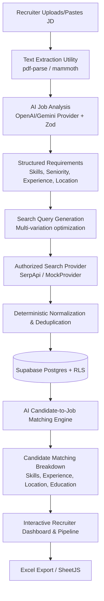

# Comprehensive Project Architecture & Deep Dive: AI-Candidate

## 1. Executive Summary & Vision
**AI-Candidate** is an enterprise-grade AI Candidate Sourcing and Recruitment Research platform engineered for hiring teams, headhunters, and talent acquisition specialists. The platform automates the time-intensive top-of-funnel recruitment workflow:
- Turning raw, unstructured job descriptions (PDFs, DOCX, text) into strict, structured talent requirements.
- Generating targeted, high-yield search queries.
- Sourcing candidates legally through authorized search providers (e.g. SerpApi, licensed candidate data APIs, or deterministic mock fixtures for development).
- Normalizing diverse search outputs into standardized candidate profiles without hallucinations or fabrication.
- Evaluating candidates with transparent, multi-dimensional AI matching scores.
- Providing an intuitive recruiter dashboard with status workflows, collaborative notes, and clean Excel export capabilities.

---

## 2. Core Architecture & Data Flow

### End-to-End Workflow:
1. **Job Description Ingestion**:
   Recruiters upload a PDF, DOCX, or text file, or paste text directly. The server extracts the text cleanly with `pdf-parse` or `mammoth`.
2. **AI Requirements Analysis**:
   The extracted text is sent to an abstracted AI provider (implementing `AIProvider`). Prompts enforce JSON Schema via Zod validation, extracting required skills, preferred skills, experience bounds, location, seniority, education, and keywords.
3. **Query Generation**:
   The system generates multiple concise search queries combining role title, key skills, and location constraints. Recruiters review and customize queries before execution.
4. **Candidate Sourcing**:
   Queries run via `SearchProvider` (`MockSearchProvider` for offline dev/testing, `SerpApiProvider` for authorized web searches).
5. **Deterministic Normalization & Duplicate Detection**:
   Raw results are normalized into `NormalizedCandidate` without AI fabrication (null fields stay null). Duplicates are detected by profile URL or name + company.
6. **AI Candidate Matching**:
   Each candidate is scored against the job specification across skills, experience, location, education, and seniority, accompanied by matched criteria, missing criteria, strengths, and concerns.
7. **Recruitment Dashboard & Actions**:
   Recruiters filter, sort, change candidate statuses (`New`, `Reviewed`, `Shortlisted`, `Rejected`, `Contacted`), add notes, and export filtered views to formatted Excel workbooks.

---

## 3. Strict Legal & Compliance Framework
- **No Unauthorized Scraping**: Strictly prohibits scraping LinkedIn, Indeed, or sites requiring login, bypassing CAPTCHAs, or violating Terms of Service.
- **Authorized Providers Only**: Uses public search APIs (Google Programmable Search, SerpApi, Serper) or licensed candidate data providers.
- **Provider Abstraction**: Decouples search providers from business logic, allowing new authorized data vendors to plug in seamlessly.
- **Data Integrity**: Candidates are normalized deterministically. Missing data is never hallucinated or assumed.

---

## 4. Technology Stack

| Layer | Technologies |
| :--- | :--- |
| **Frontend** | Next.js 15 (App Router), React 19, TypeScript, Tailwind CSS, Lucide Icons, shadcn/ui |
| **Backend** | Next.js Route Handlers, Zod schema validation, in-memory rate limiting & task queue |
| **Database & Auth** | Supabase (PostgreSQL), Supabase Auth (Email/Password), Row Level Security (RLS) |
| **AI Layer** | `AIProvider` interface, `OpenAIProvider`, retry mechanisms with exponential backoff |
| **Search Layer** | `SearchProvider` interface, `SerpApiProvider`, `MockSearchProvider` |
| **File Processing** | `pdf-parse` (PDF extraction), `mammoth` (DOCX extraction), SheetJS (`xlsx`) |
| **Testing** | Vitest, Testing Library, JSDOM |

---

## 5. UI/UX Enhancements & Alert Feedback System
- **Real-Time Toast Alerts**: Floating toast notifications provide instant feedback upon completing actions (File Extraction, Job Analysis, Search Query Generation, Candidate Sourcing, Status Updates, Recruiter Notes, and Excel Export).
- **Recruiter Dashboard**: High-visibility metric cards, candidate pipeline stages, AI match score distributions, recent job postings, and search run monitors.
- **Actionable Empty States**: Direct links to create jobs and initiate candidate discovery.
